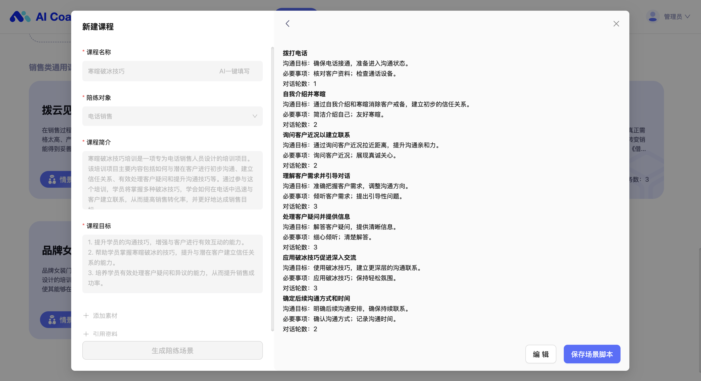
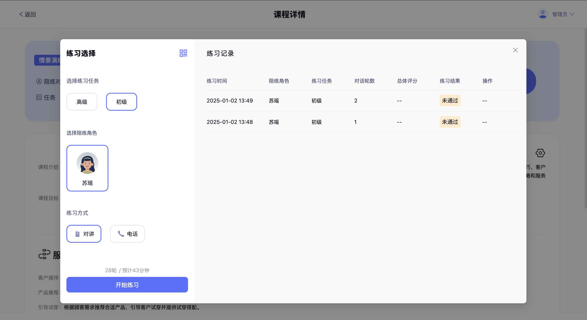

# 情景演练

幔尔智练情景演练实现业务场景剧本式模拟，适用于标准化的业务流程与话术训练，使学员在短时间内实现知识及技能的内化与落地

## AI 建课

填写课程名称，AI 一键匹配陪练对象并生成课程简介与课程目标

在这里，你可以选择添加知识素材让 AI 在生成课程内容时能够更精准地引用并参考素材；引用资料则可以补充文档或外部链接作为学习资料，在课程详情中展示。

接下来一键生成课程的对话流程阶段及脚本，支持二次编辑

## 对话流设置

选择 AI 陪练角色，可以基于陪练角色的需求智能生成对话、或通过知识素材导入智能生成对话、或直接复用问答集对话，确认后完成对话流创建。一个课程可创建多个对话流。

针对对话流，我们提供了丰富的对话配置能力

1. 平行问答与上下文问答

2. 平行问答支持随机全选、随机单选、随机多选及一问多答

3. AI 陪练的对话旁白功能

发言旁白为 AI 陪练角色发言时加入外在行为动作表现，带来更立体真实的对话体验

4. 问答对支持配置采分点(用于 AI 评测)、回答提示(学员练习时可选择是否参考回答提示)等信息

最后，让我们来完成任务设置。系统默认为大家自动生成三个任务，分别为初级、高级、测评并赋予推荐配置，可进行二次编辑；其中测评任务(考试形态)区别于初级/高级任务之处在于练习中环节无法提供学员参考回答或回答提示

所有课程均支持复制、上下线操作，其中已下线课程支持删除

## 创建数字人

情景演练课程支持数字人，这可以为练习提供更沉浸式的对话体验。

从对话流设置所选用的 AI 陪练角色中选择目标陪练，系统将自动生成数字人(这往往需要等待一小段时间)，学员在练习时选择「视频」模式即可使用

## 开始练习

课程详情页选择【练习】/【测评】任务，开始练习

情景演练将遵循对话流设置进行练习，学员可查看回答提示或参考回答、当前所处对话阶段与进度、课程信息，并在对话过程中获得自己每轮发言的 AI 测评结果

## 即时报告

练习完成系统立即生成练习报告，帮助学员完整复盘。

AI coach 自研的专业评测模型覆盖 6 大维度 55 项能力，精准反映学员综合能力，并提供整体评价、改进建议以及对话目标完成度分析；话术分析准确总结学员的优秀话术与待改进部分

在对话回顾中可逐句回听并复盘每轮对话的测评结果

## 小程序练习

情景演练同时支持小程序

