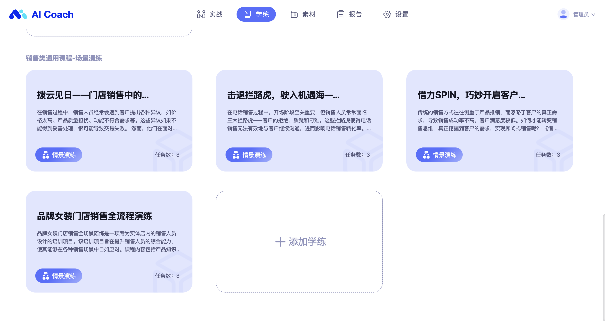
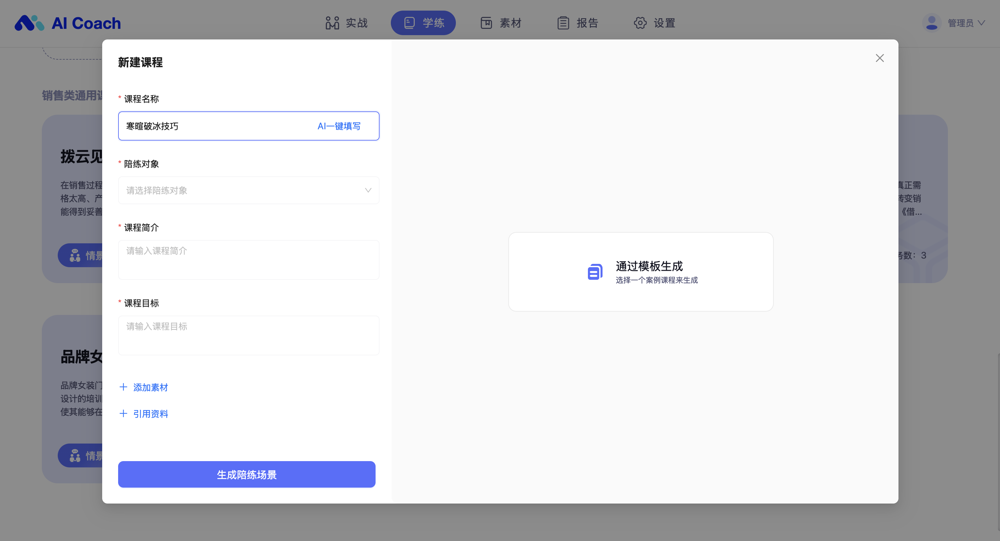
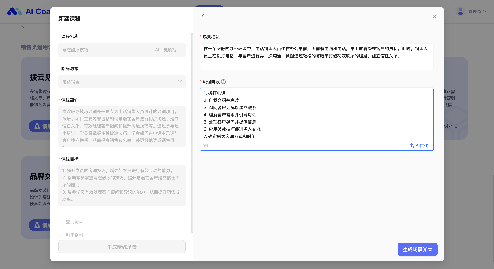
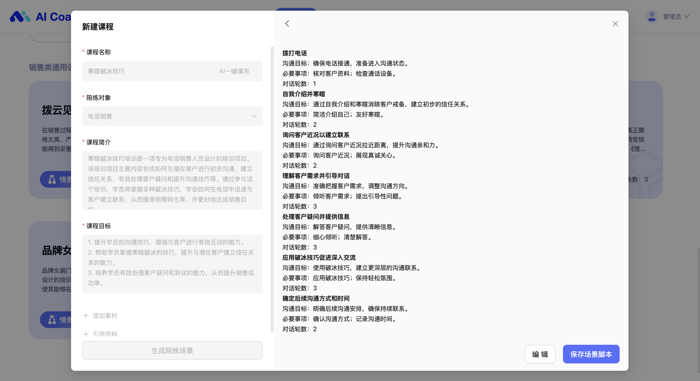

# 情景演练

幔尔智练情景演练实现业务场景剧本式模拟，适用于标准化的业务流程与话术训练，使学员在短时间内实现知识及技能的内化与落地

## AI 建课

填写课程名称，AI 一键匹配陪练对象并生成课程简介与课程目标

在这里，你可以选择添加知识素材让 AI 在生成课程内容时能够更精准地引用并参考素材；引用资料则可以补充文档或外部链接作为学习资料，在课程详情中展示。

接下来一键生成课程的对话流程阶段及脚本，支持二次编辑

